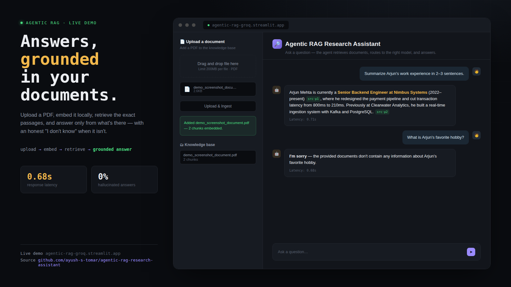

# 🔎 Agentic RAG Research Assistant


A portfolio-grade agentic RAG system: retrieval-augmented generation, tool-routing via LangGraph, cost-aware model selection, and a fine-tuned resume screener (separate service) — deployed and live.

**🔗 Live demo:** https://agentic-rag-groq.streamlit.app
**🔗 API docs:** https://agentic-rag-research-assistant-jjch.onrender.com/docs

> ⚠️ The backend runs on Render's free tier and sleeps after inactivity — the first request after idle can take 30–60s to wake up.

---

## Demo



### 📹 Video walkthrough

<video src="https://github.com/user-attachments/assets/bb46f4d4-3467-45a5-8cbe-9e20da68142b" controls width="700">
  Your browser doesn't support embedded videos. 
  <a href="https://github.com/user-attachments/assets/bb46f4d4-3467-45a5-8cbe-9e20da68142b">Watch the demo video</a>.
</video>

The example above shows the agent answering a grounded question with a source citation, then correctly refusing a question the uploaded document doesn't cover — rather than guessing.

---

## What it does

Ask a question, and the agent:
1. Retrieves relevant chunks from a Chroma vector store built from your uploaded PDFs
2. Answers **only** from retrieved content — if nothing relevant is found, it says so instead of guessing
3. Routes queries between `llama-3.1-8b-instant` and `openai/gpt-oss-120b` based on complexity, so short factual questions don't pay large-model latency/cost

A LoRA fine-tuned resume screener exists as a separate service and can be called via `screen_resume` — not wired into the live demo's default flow.

---

## Architecture

```
User question
     │
     ▼
FastAPI backend (src/api.py)  ──deployed on Render
     │
     ▼
LangGraph ReAct agent (src/agent.py)  ──Groq / gpt-oss-120b
     │
     ├── retrieve_docs  → Chroma vector store (local documents)
     ├── screen_resume  → fine-tuned LoRA resume screener (separate service)
     └── route_query    → answers via llama-3.1-8b-instant or gpt-oss-120b based on query complexity
     │
     ▼
Answer + latency logged to src/eval/request_log.csv
     │
     ▼
Streamlit frontend (frontend/app.py)  ──deployed on Streamlit Community Cloud
```

## Tech stack

| Layer | Tech |
|---|---|
| LLM inference | Groq — `openai/gpt-oss-120b` (primary), `llama-3.1-8b-instant` (routed, low-complexity queries) |
| Agent framework | LangGraph (ReAct agent) |
| Vector store | Chroma |
| Embeddings | HuggingFace `bge-small-en-v1.5` |
| Backend | FastAPI |
| Frontend | Streamlit |
| Backend hosting | Render (free tier) |
| Frontend hosting | Streamlit Community Cloud |

> **Note on the model:** this project originally ran `llama-3.3-70b-versatile`. Groq deprecated that model on 2026-06-17 (shutdown 2026-08-16), so the agent was migrated to `openai/gpt-oss-120b` — Groq's recommended replacement, with full tool-calling support and a higher free-tier token budget (200K TPD vs 100K TPD).

---

## Quickstart — run it locally

```powershell
# 1. Setup
python -m venv venv
venv\Scripts\Activate.ps1
pip install -r requirements.txt
copy .env.example .env
# then edit .env and add your GROQ_API_KEY (https://console.groq.com)

# 2. Add documents
# Drop PDF files into data\raw\

# 3. Build the knowledge base
python src\ingest.py

# 4. Sanity-check retrieval
python src\retrieve_test.py "a question about your documents"

# 5. Test the full agent directly
python src\agent.py "a question about your documents"

# 6. Run the backend
uvicorn src.api:app --reload
# visit http://localhost:8000/docs

# 7. Run the frontend (in a second terminal, venv activated)
streamlit run frontend\app.py
```

---

## Project phases

| Phase | What | File(s) |
|---|---|---|
| 1 | Ingest & chunk documents | `src/ingest.py` |
| 2 | Embed, store, basic RAG | `src/ingest.py`, `src/retrieve_test.py`, `src/rag_basic.py` |
| 3 | Agent + tools + routing | `src/agent.py`, `src/tools/tools.py` |
| 4 | Evaluation | `src/eval/run_eval.py`, `src/eval/cost_comparison.py` |
| 5 | Deployment | `src/api.py`, `frontend/app.py` — see below |
| 6 | Writeup | this README |

---

## Deployment

**Backend (Render):**
- Build command: `pip install -r requirements.txt && python src/ingest.py`
- Start command: `uvicorn src.api:app --host 0.0.0.0 --port $PORT`
- Environment variables: `GROQ_API_KEY`, `HUGGINGFACEHUB_API_TOKEN`
- The vector store rebuilds from `data/raw/` on every deploy, since Render's free-tier filesystem doesn't persist across restarts.

**Frontend (Streamlit Community Cloud):**
- Main file: `frontend/app.py`
- Secret: `API_URL = "https://agentic-rag-research-assistant-jjch.onrender.com"`

CORS on the backend is scoped to the deployed Streamlit origin only.

---

## Design decisions & tradeoffs

- **Groq over OpenAI** — chosen for fast, cheap inference, at the cost of occasional tool-calling quirks on ambiguous questions (see Known limitations).
- **Strict grounding via system prompt** — the agent is instructed to refuse rather than answer from general knowledge, prioritizing trustworthiness over coverage.
- **Chroma rebuilt on every deploy** rather than persisted, trading a few seconds of startup time for zero infra complexity on the free tier.
- **Two-model routing** — `route_query` answers low-complexity questions with `llama-3.1-8b-instant` instead of always paying `gpt-oss-120b` pricing/latency. The complexity gate is a word-count heuristic, not a trained classifier — cheap to run, occasionally wrong on edge cases.

## Known limitations

- `gpt-oss-120b`'s tool-calling via Groq occasionally malforms a function call on ambiguous questions, surfacing as a 500 error. Not yet hardened — a candidate for a stricter tool-calling system prompt or a fallback retry.
- `screen_resume` expects a separate local/deployed service (`llm-finetune-resume-screener`) and fails gracefully if it's not reachable — this feature isn't live in the deployed demo.
- `route_query`'s complexity gate is a word-count heuristic, not a trained classifier — it will occasionally misroute a short-but-hard question to the cheaper model.

---

## Results

Eval harness (RAGAS: faithfulness, answer relevancy, context precision) is built in `src/eval/run_eval.py`. Scores are pending a real 30–50 question/answer set in `src/eval/eval_set.jsonl` — currently placeholder entries.

Cost comparison (`src/eval/cost_comparison.py`) pulls real per-model traffic from `src/eval/request_log.csv` once there's enough routed traffic logged; falls back to a clearly-labeled projection otherwise.

## What I'd improve with more time

Persistent vector store (avoid full rebuild on every Render deploy), a trained complexity classifier in place of the word-count heuristic, and a stricter tool-calling system prompt to eliminate the occasional malformed Groq tool call.
